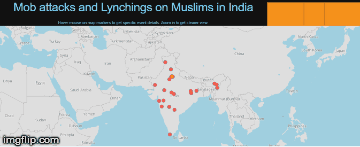

## Interactive visualization of attacks on muslims in recent times in India using dash by plotly.

Check out the app here: https://lynching-india.herokuapp.com/

Collected the information from the web into a csv, then calculated the coordinates from the location names using a python script. Then played around with the new tool in the house, dash. The data is available in this google sheet('https://docs.google.com/spreadsheets/d/1ZvtD0mbg35MgAb7UD-yq2CswNn_kF-3oOaNXEYOV46U/edit?usp=sharing'),  feel free to add new events, I will update the visualization periodically.

Here's a glance from the app:

